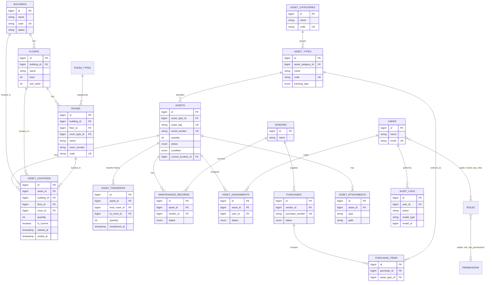

# School Asset & Inventory Management System — Architecture Document

This document covers items A–J from the specification: architecture, ERD, schema, model relationships, API design, frontend architecture, permission matrix, development phases, risks, and recommendations. No implementation code is included yet, per your instruction — this is the design to review and approve before Phase 1 begins.

---

## A. Complete System Architecture

### A.1 Layered architecture

```
┌───────────────────────────────────────────────────────────────┐
│  CLIENT — Vue 3 SPA (Vite, Pinia, Vue Router, Tailwind, Axios) │
└───────────────────────────────────────────────────────────────┘
                              │ HTTPS / JSON (Bearer token, Sanctum)
┌───────────────────────────────────────────────────────────────┐
│  API LAYER — /api/v1                                          │
│  Route → Middleware (auth:sanctum, throttle, permission)      │
│        → Controller (thin) → Form Request (validation)        │
└───────────────────────────────────────────────────────────────┘
                              │
┌───────────────────────────────────────────────────────────────┐
│  APPLICATION LAYER                                             │
│  Services (business logic) · Policies (authorization)         │
│  Events/Listeners (audit, notifications) · DTOs                │
└───────────────────────────────────────────────────────────────┘
                              │
┌───────────────────────────────────────────────────────────────┐
│  DOMAIN / PERSISTENCE LAYER                                    │
│  Eloquent Models · Scopes · Enums · Selective Repositories     │
│  (only for Asset search/report queries with real complexity)  │
└───────────────────────────────────────────────────────────────┘
                              │
┌───────────────────────────────────────────────────────────────┐
│  MySQL 8 — normalized schema, FKs, indexes, transactions       │
└───────────────────────────────────────────────────────────────┘
```

### A.2 Key architectural decisions

| Decision | Rationale |
|---|---|
| Controllers are thin; all business logic in Services | Testability, reuse across API/console/queue contexts |
| Repository pattern used **only** for `AssetRepository` (complex filtered/reported queries) | Avoids repository-over-Eloquent boilerplate everywhere else, per your instruction |
| Every multi-step write (transfer, disposal, assignment) wrapped in `DB::transaction()` | Guarantees location history / audit consistency |
| Audit logging via a dedicated `Auditable` trait + model observers, not manual calls in every service method | Prevents missed audit entries when new mutation paths are added |
| Current location is **derived**, not just stored | `assets.current_location_id` is a denormalized pointer for fast reads, but the source of truth is `asset_locations` where `is_current = true`. A DB-level partial unique index (or app-level guarantee) ensures only one current row per asset. |
| PHP backed enums (`AssetStatus`, `AssetCondition`, `TrackingType`, `MaintenanceStatus`, `AssignmentStatus`) | Type safety, avoids magic strings, easy `match()` usage in services |
| Spatie Permission + Laravel Policies together | Spatie handles role/permission storage & checks; Policies encapsulate "can this user act on *this* record" (e.g., cross-building rules) |
| API Resources for every response; no raw model returns | Prevents leaking internal columns (`created_by` IDs vs names, soft-delete columns, etc.) |
| Soft deletes on structural + transactional tables; **status transitions** (not deletes) on `assets` | Preserves inventory history permanently, matches requirement in §14/§38 |
| Events: `AssetTransferred`, `AssetAssigned`, `MaintenanceStatusChanged`, `AssetCreated` | Listeners handle audit logging + (future) notifications, decoupled from services |

### A.3 Request lifecycle example — Asset Transfer

```
POST /api/v1/asset-transfers
  → TransferAssetRequest (validates source==current location, qty ≤ available, dest hierarchy consistent)
  → AssetTransferPolicy::create (permission: assets.transfer)
  → AssetTransferController::store (thin — calls service, returns resource)
  → AssetTransferService::transfer()
        DB::transaction {
          1. Lock current asset_locations row (SELECT ... FOR UPDATE)
          2. Validate quantity available
          3. Close current asset_locations row (ended_at = now, is_current = false)
          4. Create new asset_locations row (is_current = true)
          5. Update assets.current_location_id
          6. Create asset_transfers record
          7. Fire AssetTransferred event → AuditLogListener writes audit_logs
        }
  → AssetTransferResource
```

---

## B. Complete ERD



Note: the Spatie permission tables (`roles`, `permissions`, `model_has_roles`, `model_has_permissions`, `role_has_permissions`) are generated by the package's own migrations and are not redesigned here.

---

## C. Database Table Design

Conventions applied to every table below unless noted: `id BIGINT UNSIGNED AUTO_INCREMENT PK`, `created_at`/`updated_at` timestamps, `InnoDB`, `utf8mb4`. Soft-delete tables add `deleted_at NULLABLE, INDEX`.

### buildings
| Column | Type | Constraints |
|---|---|---|
| name | VARCHAR(150) | NOT NULL |
| code | VARCHAR(20) | UNIQUE, NOT NULL |
| description | TEXT | NULLABLE |
| status | ENUM('active','inactive') | DEFAULT 'active', INDEX |
| sort_order | SMALLINT UNSIGNED | DEFAULT 0 |
Soft deletes: yes. Indexes: `status`, `deleted_at`.

### floors
| Column | Type | Constraints |
|---|---|---|
| building_id | BIGINT UNSIGNED | FK → buildings.id (RESTRICT on delete), INDEX |
| name | VARCHAR(100) | NOT NULL |
| level | SMALLINT | NOT NULL (e.g. -1 for Basement, 1..7) |
| sort_order | SMALLINT UNSIGNED | DEFAULT 0 |
| status | ENUM('active','inactive') | DEFAULT 'active' |
Unique: `(building_id, name)`. Soft deletes: yes.

### room_types
| Column | Type | Constraints |
|---|---|---|
| name | VARCHAR(100) | UNIQUE, NOT NULL (e.g. Classroom, Corridor, Laboratory, Office) |
| description | TEXT | NULLABLE |
| status | ENUM('active','inactive') | DEFAULT 'active' |
Soft deletes: not required (lookup table) but included for consistency.

### rooms
| Column | Type | Constraints |
|---|---|---|
| building_id | BIGINT UNSIGNED | FK → buildings.id, INDEX |
| floor_id | BIGINT UNSIGNED | FK → floors.id, INDEX |
| room_type_id | BIGINT UNSIGNED | FK → room_types.id, NULLABLE, INDEX |
| name | VARCHAR(100) | NOT NULL |
| room_number | VARCHAR(20) | NULLABLE (non-numbered rooms like "Corridor" leave this null) |
| code | VARCHAR(30) | UNIQUE, NOT NULL (e.g. `MC-L1-101`) |
| capacity | SMALLINT UNSIGNED | NULLABLE |
| status | ENUM('active','inactive') | DEFAULT 'active' |
Unique: `(floor_id, room_number)` where room_number is not null (application-level check, since MySQL unique indexes treat NULLs as distinct — this is actually fine and desired here). Soft deletes: yes.
**Integrity rule (app + DB):** a trigger or service-level check must confirm `floor_id.building_id == rooms.building_id` on insert/update — see §I Risks.

### asset_categories
| Column | Type | Constraints |
|---|---|---|
| name | VARCHAR(100) | UNIQUE, NOT NULL |
| code | VARCHAR(20) | UNIQUE, NOT NULL |
| description | TEXT | NULLABLE |
| status | ENUM('active','inactive') | DEFAULT 'active' |
Soft deletes: yes.

### asset_types
| Column | Type | Constraints |
|---|---|---|
| asset_category_id | BIGINT UNSIGNED | FK → asset_categories.id, INDEX |
| name | VARCHAR(150) | NOT NULL |
| code | VARCHAR(30) | UNIQUE, NOT NULL |
| tracking_type | ENUM('individual','quantity') | NOT NULL |
| description | TEXT | NULLABLE |
| status | ENUM('active','inactive') | DEFAULT 'active' |
Unique: `(asset_category_id, name)`. Soft deletes: yes.

### assets
| Column | Type | Constraints |
|---|---|---|
| asset_type_id | BIGINT UNSIGNED | FK → asset_types.id, INDEX |
| asset_tag | VARCHAR(30) | UNIQUE NULLABLE (required only when tracking_type = individual — enforced in FormRequest/Service, not DB, since MySQL cannot conditionally enforce NOT NULL) |
| serial_number | VARCHAR(100) | UNIQUE NULLABLE |
| name | VARCHAR(150) | NOT NULL |
| brand | VARCHAR(100) | NULLABLE, INDEX |
| model | VARCHAR(100) | NULLABLE |
| quantity | INT UNSIGNED | DEFAULT 1 (always 1 for individual assets, N for quantity assets) |
| unit | VARCHAR(20) | NULLABLE (e.g. "pcs", "set") |
| purchase_date | DATE | NULLABLE |
| purchase_price | DECIMAL(12,2) | NULLABLE |
| warranty_expiry | DATE | NULLABLE, INDEX |
| condition | ENUM('new','good','fair','poor','damaged') | DEFAULT 'new', INDEX |
| status | ENUM('active','in_storage','under_maintenance','damaged','lost','retired','disposed') | DEFAULT 'active', INDEX |
| description | TEXT | NULLABLE |
| current_location_id | BIGINT UNSIGNED | FK → asset_locations.id, NULLABLE, INDEX |
| created_by | BIGINT UNSIGNED | FK → users.id |
| updated_by | BIGINT UNSIGNED | FK → users.id, NULLABLE |
Soft deletes: yes (used rarely — status transitions are preferred, see §14). Full-text index candidate on `(name, brand, model)` for search (§21).

### asset_locations
| Column | Type | Constraints |
|---|---|---|
| asset_id | BIGINT UNSIGNED | FK → assets.id, INDEX |
| building_id | BIGINT UNSIGNED | FK → buildings.id |
| floor_id | BIGINT UNSIGNED | FK → floors.id |
| room_id | BIGINT UNSIGNED | FK → rooms.id, NULLABLE (asset can be "in building" without a room during intake) |
| quantity | INT UNSIGNED | NOT NULL |
| started_at | TIMESTAMP | NOT NULL |
| ended_at | TIMESTAMP | NULLABLE |
| is_current | BOOLEAN | DEFAULT false, INDEX |
| created_by | BIGINT UNSIGNED | FK → users.id |
Index: `(asset_id, is_current)`. Application-enforced invariant: exactly one `is_current = true` row per `asset_id` at any time (enforced inside the transfer transaction, not by a DB constraint, since MySQL lacks partial unique indexes — documented as a risk in §I).

### asset_transfers
| Column | Type | Constraints |
|---|---|---|
| asset_id | BIGINT UNSIGNED | FK → assets.id, INDEX |
| from_building_id / from_floor_id / from_room_id | BIGINT UNSIGNED | FK, NULLABLE (null on first intake) |
| to_building_id / to_floor_id / to_room_id | BIGINT UNSIGNED | FK, NOT NULL |
| quantity | INT UNSIGNED | NOT NULL |
| reason | VARCHAR(255) | NULLABLE |
| reference | VARCHAR(100) | NULLABLE, INDEX |
| transferred_by | BIGINT UNSIGNED | FK → users.id |
| transferred_at | TIMESTAMP | NOT NULL, INDEX |
| notes | TEXT | NULLABLE |
This table is an append-only ledger — no soft deletes, no updates after creation.

### maintenance_records
| Column | Type | Constraints |
|---|---|---|
| asset_id | BIGINT UNSIGNED | FK → assets.id, INDEX |
| vendor_id | BIGINT UNSIGNED | FK → vendors.id, NULLABLE |
| issue | VARCHAR(255) | NOT NULL |
| description | TEXT | NULLABLE |
| reported_at | TIMESTAMP | NOT NULL |
| started_at / completed_at | TIMESTAMP | NULLABLE |
| cost | DECIMAL(10,2) | NULLABLE |
| status | ENUM('reported','in_progress','completed','cancelled') | DEFAULT 'reported', INDEX |
| resolution | TEXT | NULLABLE |
| notes | TEXT | NULLABLE |
| created_by | BIGINT UNSIGNED | FK → users.id |
Soft deletes: yes.

### asset_assignments
| Column | Type | Constraints |
|---|---|---|
| asset_id | BIGINT UNSIGNED | FK → assets.id, INDEX |
| user_id | BIGINT UNSIGNED | FK → users.id, INDEX |
| assigned_by | BIGINT UNSIGNED | FK → users.id |
| assigned_at | TIMESTAMP | NOT NULL |
| returned_at | TIMESTAMP | NULLABLE |
| status | ENUM('active','returned','lost') | DEFAULT 'active', INDEX |
| notes | TEXT | NULLABLE |
Soft deletes: yes.

### vendors
| Column | Type | Constraints |
|---|---|---|
| name | VARCHAR(150) | NOT NULL |
| contact_person | VARCHAR(100) | NULLABLE |
| phone | VARCHAR(30) | NULLABLE |
| email | VARCHAR(150) | NULLABLE |
| address | TEXT | NULLABLE |
| notes | TEXT | NULLABLE |
| status | ENUM('active','inactive') | DEFAULT 'active' |
Soft deletes: yes.

### purchases
| Column | Type | Constraints |
|---|---|---|
| purchase_number | VARCHAR(30) | UNIQUE, NOT NULL |
| vendor_id | BIGINT UNSIGNED | FK → vendors.id, INDEX |
| purchase_date | DATE | NOT NULL |
| invoice_number | VARCHAR(50) | NULLABLE |
| subtotal / tax / discount / total | DECIMAL(12,2) | NOT NULL, DEFAULT 0 |
| status | ENUM('draft','ordered','received','cancelled') | DEFAULT 'draft', INDEX |
| notes | TEXT | NULLABLE |
| created_by | BIGINT UNSIGNED | FK → users.id |
Soft deletes: yes.

### purchase_items
| Column | Type | Constraints |
|---|---|---|
| purchase_id | BIGINT UNSIGNED | FK → purchases.id (CASCADE on delete), INDEX |
| asset_type_id | BIGINT UNSIGNED | FK → asset_types.id, INDEX |
| quantity | INT UNSIGNED | NOT NULL |
| unit_price | DECIMAL(10,2) | NOT NULL |
| total | DECIMAL(12,2) | NOT NULL (computed at write time, not a generated column, to preserve historical price even if logic changes) |

### asset_attachments
| Column | Type | Constraints |
|---|---|---|
| asset_id | BIGINT UNSIGNED | FK → assets.id, INDEX |
| type | ENUM('invoice','warranty','purchase_doc','repair_doc','photo','other') | NOT NULL |
| original_name | VARCHAR(255) | NOT NULL |
| path | VARCHAR(255) | NOT NULL (stored outside public/, served via signed route) |
| mime_type | VARCHAR(100) | NOT NULL |
| size | INT UNSIGNED | NOT NULL (bytes) |
| uploaded_by | BIGINT UNSIGNED | FK → users.id |
Soft deletes: yes.

### audit_logs
| Column | Type | Constraints |
|---|---|---|
| user_id | BIGINT UNSIGNED | FK → users.id, NULLABLE (system actions), INDEX |
| action | VARCHAR(50) | NOT NULL, INDEX (e.g. `asset.created`, `asset.transferred`) |
| model_type | VARCHAR(150) | NOT NULL, INDEX |
| model_id | BIGINT UNSIGNED | NOT NULL, INDEX |
| old_values | JSON | NULLABLE |
| new_values | JSON | NULLABLE |
| ip_address | VARCHAR(45) | NULLABLE |
| user_agent | VARCHAR(255) | NULLABLE |
| created_at | TIMESTAMP | NOT NULL |
Composite index: `(model_type, model_id)`. No `updated_at` — append-only, never updated.

### users (extends Laravel default)
Adds: `employee_id VARCHAR(30) NULLABLE UNIQUE`, `phone VARCHAR(30) NULLABLE`, `status ENUM('active','inactive') DEFAULT 'active'`. Roles/permissions come from Spatie's own tables.

---

## D. Laravel Model Relationships

```
Building
  hasMany Floor
  hasMany Room (through Floor, but also direct FK for query convenience)
  hasMany AssetLocation
  hasMany AssetTransfer (as from/to, two relations each direction)

Floor
  belongsTo Building
  hasMany Room
  hasMany AssetLocation

RoomType
  hasMany Room

Room
  belongsTo Building
  belongsTo Floor
  belongsTo RoomType
  hasMany AssetLocation
  hasMany Asset (through current_location, scope-based, not a direct FK)

AssetCategory
  hasMany AssetType

AssetType
  belongsTo AssetCategory
  hasMany Asset
  hasMany PurchaseItem

Asset
  belongsTo AssetType
  belongsTo AssetLocation (current, via current_location_id)
  hasMany AssetLocation (full history)
  hasMany AssetTransfer
  hasMany MaintenanceRecord
  hasMany AssetAssignment
  hasMany AssetAttachment
  belongsTo User (createdBy)
  belongsTo User (updatedBy)
  morphMany AuditLog (via model_type/model_id, or explicit hasMany with a scope)

AssetLocation
  belongsTo Asset
  belongsTo Building
  belongsTo Floor
  belongsTo Room (nullable)
  belongsTo User (createdBy)
  scope current() → where('is_current', true)

AssetTransfer
  belongsTo Asset
  belongsTo Building (fromBuilding / toBuilding — two relations)
  belongsTo Floor (fromFloor / toFloor)
  belongsTo Room (fromRoom / toRoom)
  belongsTo User (transferredBy)

MaintenanceRecord
  belongsTo Asset
  belongsTo Vendor (nullable)
  belongsTo User (createdBy)

AssetAssignment
  belongsTo Asset
  belongsTo User (assignee)
  belongsTo User (assignedBy)

Vendor
  hasMany MaintenanceRecord
  hasMany Purchase

Purchase
  belongsTo Vendor
  hasMany PurchaseItem
  belongsTo User (createdBy)

PurchaseItem
  belongsTo Purchase
  belongsTo AssetType

AssetAttachment
  belongsTo Asset
  belongsTo User (uploadedBy)

AuditLog
  belongsTo User (nullable)
  morphTo model (polymorphic-style via model_type/model_id, read-only)

User (App\Models\User)
  uses HasRoles (Spatie)
  hasMany Asset (createdBy)
  hasMany AssetAssignment
  hasMany AuditLog
```

Traits used across models: `SoftDeletes` (where applicable), `Auditable` (custom trait that registers a model observer writing to `audit_logs` on created/updated/deleted), `HasFactory`.

---

## E. API Endpoint Structure (`/api/v1`)

All endpoints require `auth:sanctum` except `/auth/login`. Each is gated by the permission noted.

```
POST   /auth/login
POST   /auth/logout                          (auth)
GET    /auth/me                               (auth)

GET    /buildings                             buildings.view
POST   /buildings                             buildings.create
GET    /buildings/{id}                        buildings.view
PUT    /buildings/{id}                        buildings.update
DELETE /buildings/{id}                        buildings.delete
PATCH  /buildings/{id}/reorder                buildings.update
PATCH  /buildings/{id}/status                 buildings.update

GET    /floors                                floors.view   (?building_id=)
POST   /floors                                floors.create
GET    /floors/{id}                           floors.view
PUT    /floors/{id}                           floors.update
DELETE /floors/{id}                           floors.delete
PATCH  /floors/{id}/reorder                   floors.update

GET    /room-types                            rooms.view
POST   /room-types                            rooms.create
PUT    /room-types/{id}                       rooms.update
DELETE /room-types/{id}                       rooms.delete

GET    /rooms                                 rooms.view    (?building_id=&floor_id=)
POST   /rooms                                 rooms.create
GET    /rooms/{id}                            rooms.view
PUT    /rooms/{id}                            rooms.update
DELETE /rooms/{id}                            rooms.delete

GET    /asset-categories                      assets.view
POST   /asset-categories                      assets.create
PUT    /asset-categories/{id}                 assets.update
DELETE /asset-categories/{id}                 assets.delete

GET    /asset-types                           assets.view   (?category_id=)
POST   /asset-types                           assets.create
PUT    /asset-types/{id}                      assets.update
DELETE /asset-types/{id}                      assets.delete

GET    /assets                                assets.view   (paginated, filterable, searchable)
POST   /assets                                assets.create
GET    /assets/{id}                           assets.view
PUT    /assets/{id}                           assets.update
DELETE /assets/{id}                           assets.delete   (soft delete / status change)
GET    /assets/{id}/locations                 assets.view    (full history)
GET    /assets/{id}/audit-log                 audit.view

POST   /asset-transfers                       assets.transfer
GET    /asset-transfers                       assets.view    (?asset_id=&building_id=&date_from=&date_to=)
GET    /asset-transfers/{id}                  assets.view

GET    /maintenance-records                   maintenance.view  (?asset_id=&status=)
POST   /maintenance-records                   maintenance.create
PUT    /maintenance-records/{id}               maintenance.update
GET    /maintenance-records/{id}               maintenance.view

GET    /asset-assignments                      assets.view     (?asset_id=&user_id=)
POST   /asset-assignments                       assets.update
PATCH  /asset-assignments/{id}/return           assets.update

GET    /vendors                                assets.view
POST   /vendors                                assets.create
PUT    /vendors/{id}                           assets.update
DELETE /vendors/{id}                           assets.delete

GET    /purchases                              assets.view
POST   /purchases                              assets.create
GET    /purchases/{id}                         assets.view
PUT    /purchases/{id}                         assets.update

POST   /assets/{id}/attachments                assets.update    (multipart)
GET    /assets/{id}/attachments                assets.view
DELETE /attachments/{id}                        assets.update

GET    /reports/inventory                       reports.view
GET    /reports/inventory/building/{id}         reports.view
GET    /reports/inventory/floor/{id}             reports.view
GET    /reports/inventory/room/{id}              reports.view
GET    /reports/inventory/category/{id}          reports.view
GET    /reports/status                           reports.view
GET    /reports/condition                        reports.view
GET    /reports/movement                         reports.view
GET    /reports/maintenance                      reports.view
GET    /reports/lost                             reports.view
GET    /reports/disposed                         reports.view
GET    /reports/warranty-expiry                  reports.view
GET    /reports/{type}/export?format=csv|xlsx|pdf   reports.view

GET    /audit-logs                               audit.view    (?model_type=&model_id=&user_id=&date_from=&date_to=)

GET    /dashboard/summary                        (any authenticated role, scoped by permission)
GET    /dashboard/charts

GET    /users                                    users.manage
POST   /users                                    users.manage
PUT    /users/{id}                               users.manage
DELETE /users/{id}                               users.manage
GET    /roles                                    roles.manage
POST   /roles                                    roles.manage
PUT    /roles/{id}                               roles.manage
GET    /permissions                              roles.manage
```

Response envelope (consistent across all endpoints):
```json
{
  "success": true,
  "data": { },
  "meta": { "current_page": 1, "per_page": 20, "total": 134 },
  "message": null
}
```
Errors follow the same shape with `"success": false`, `"errors": {...}` (validation) and an HTTP status matching the failure (422, 403, 404, 409 for conflicts like insufficient transfer quantity).

---

## F. Vue Frontend Architecture

```
src/
  api/                    # one module per resource, axios instance with interceptors
    http.js               # axios instance, auth header injection, 401 → logout
    buildings.js, floors.js, rooms.js, assets.js, transfers.js,
    maintenance.js, assignments.js, vendors.js, purchases.js,
    reports.js, auditLogs.js, users.js, roles.js
  stores/                 # Pinia
    auth.js               # user, token, permissions, roles
    ui.js                 # sidebar state, toasts, modals
    buildings.js, rooms.js, assets.js, transfers.js  # cached lookup + list state
  router/
    index.js              # route table
    guards.js             # auth guard + permission guard (checks store.hasPermission)
  layouts/
    AdminLayout.vue        # sidebar + navbar + breadcrumbs + <router-view>
    AuthLayout.vue
  components/
    common/                # DataTable, Modal, ConfirmDialog, Toast, Pagination, FilterBar, EmptyState
    assets/                 # AssetForm, AssetTable, AssetLocationBadge
    transfers/               # TransferForm, LocationPicker (building→floor→room cascading select)
    explorer/                 # BuildingTree, FloorPanel, RoomAssetList
    charts/                    # wraps a charting lib per dashboard widget
  pages/
    dashboard/DashboardPage.vue
    buildings/ (List, Form)
    floors/ (List, Form)
    rooms/ (List, Form)
    assets/ (List, Detail (tabbed), Form)
    transfers/ (List, Create)
    maintenance/ (List, Form)
    assignments/ (List)
    vendors/ (List, Form)
    purchases/ (List, Form)
    reports/ (ReportsHub, per-report view)
    audit/AuditLogPage.vue
    explorer/ExplorerPage.vue
    users/ (List, Form), roles/RolesPage.vue
    auth/LoginPage.vue
  composables/
    usePagination.js, useFilters.js, useDebouncedSearch.js, usePermission.js, useConfirm.js
  utils/
    formatters.js (currency, date), constants.js (enums mirrored from backend)
```

Key patterns:
- **`usePermission()`** composable wraps `authStore.permissions.includes(...)`, used to hide/disable UI — but the API is always the real gate (§15).
- **Cascading location selects** (Building → Floor → Room) are a single reusable `<LocationPicker>` component used in both the Asset form and the Transfer form, backed by the `rooms` store's cached, filtered lists.
- **DataTable** component is generic: takes columns, a fetch function (server-side pagination/sort/filter), and slot-based row actions — reused across Assets, Transfers, Maintenance, Purchases, Audit Log.
- State that must survive navigation (current filters, selected asset for transfer) lives in Pinia; everything else stays local component state.

---

## G. Permission Matrix

Legend: ✅ full access · 👁 view-only · — none. Rows are Spatie roles; the concrete permission strings from §15 map to these groups.

| Permission group | Super Admin | Admin | Inventory Manager | IT Manager | Staff | Viewer |
|---|:---:|:---:|:---:|:---:|:---:|:---:|
| buildings.* | ✅ | ✅ | 👁 | 👁 | — | 👁 |
| floors.* | ✅ | ✅ | 👁 | 👁 | — | 👁 |
| rooms.* | ✅ | ✅ | ✅ | 👁 | — | 👁 |
| assets.view | ✅ | ✅ | ✅ | ✅ | 👁 (own assignments) | 👁 |
| assets.create/update | ✅ | ✅ | ✅ | ✅ (IT-category types only, via policy) | — | — |
| assets.delete | ✅ | ✅ | ✅ | — | — | — |
| assets.transfer | ✅ | ✅ | ✅ | ✅ | — | — |
| maintenance.* | ✅ | ✅ | ✅ | ✅ | 👁 (own reported) | 👁 |
| reports.view | ✅ | ✅ | ✅ | ✅ | — | 👁 |
| users.manage | ✅ | ✅ | — | — | — | — |
| roles.manage | ✅ | — | — | — | — | — |
| audit.view | ✅ | ✅ | 👁 | — | — | — |

Notes:
- "IT Manager" scoping to IT-category asset types is enforced in a Policy (`AssetPolicy::update`), not just a permission string, since Spatie permissions alone can't express "only this category."
- `Staff` can view/return only their **own** `asset_assignments` (Policy-scoped), matching §11's "assigned to teachers/staff" use case.
- This table is the starting seeder for `RoleSeeder` / `PermissionSeeder`; exact permission-string-to-role mapping will be enumerated in code in Phase 1.

---

## H. Development Roadmap

| Phase | Scope | Depends on |
|---|---|---|
| **0** | Laravel + Vue project scaffolding, Sanctum, Spatie install, base config, CI skeleton | — |
| **1** | Location hierarchy: Building, Floor, RoomType, Room — migrations, models, policies, Form Requests, API Resources, controllers, seeders, tests. Vue: Explorer read views + CRUD forms. | 0 |
| **2** | Asset taxonomy: AssetCategory, AssetType (with tracking_type). CRUD + seeders + Vue forms. | 1 |
| **3** | Core Asset entity + AssetLocation (creation = initial location placement). Search & filters. Vue: Asset List + Create/Edit + Detail (Overview tab only). | 2 |
| **4** | Asset Transfer system (the transactional core) + full movement history tab. Vue: Transfer UI, Movement History tab. | 3 |
| **5** | Maintenance records + Asset Assignments. Vue: respective tabs on Asset Detail + list pages. | 3 |
| **6** | Vendors, Purchases, Purchase Items. Vue: Vendor/Purchase CRUD. | 2 |
| **7** | Attachments (secure upload/download). Vue: Documents tab. | 3 |
| **8** | Audit logging (trait + observer + listener wiring across all above) + Audit Log viewer. *(Designed from Phase 1 onward, but the viewer/report UI lands here once enough mutation types exist to demo.)* | 1–7 |
| **9** | RBAC hardening pass: full permission matrix seeded, User/Role management UI. | 0–8 |
| **10** | Dashboard (summary cards + charts) + global search. | 3–8 |
| **11** | Reporting module + CSV/Excel/PDF export. | 3–8 |
| **12** | QR code hook points (asset public lookup route, tag rendering) — deliberately last since §32 asks it be decoupled and non-blocking. | 3 |
| **13** | Test hardening, API documentation (OpenAPI), performance pass (index review, N+1 audit), security review. | all |

Each phase ships with: migrations, models, policies, Form Requests, Resources, controllers, feature/unit tests, seeders, and the corresponding Vue pages — plus a short verification checklist, as required by §36.

---

## I. Risks and Edge Cases

| Risk / edge case | Mitigation |
|---|---|
| MySQL can't enforce "exactly one `is_current=true` row per asset" at the DB level | Enforced inside the transfer transaction with a row lock (`SELECT ... FOR UPDATE`) on the current location before closing it; covered by a dedicated concurrency test. |
| Room referencing a floor from a different building (§27) | Enforced in `RoomService`/`RoomRequest` with an explicit check `floor.building_id === input.building_id` before insert/update; also covered by a feature test for the negative case. |
| Partial-quantity transfers leaving the source location with 0 but not closed, or over-transferring | Service validates `quantity <= current asset_locations.quantity` before any write; if the full quantity moves, the source row is closed (`is_current=false`); if partial, the source row's quantity is decremented and a new row is created for the moved portion. |
| Serialized asset created without asset_tag, or quantity asset given a serial number | `AssetType.tracking_type` drives conditional validation in `AssetRequest` — DB allows NULL, business rules enforce it. |
| Race condition: two transfers submitted for the same asset simultaneously | Pessimistic locking (`lockForUpdate`) on the asset's current location row inside the transaction; second request fails fast with a 409 rather than corrupting history. |
| Soft-deleting a Building/Floor/Room that still has active assets located in it | Policy/service blocks delete (or requires force + reassignment) when child rows or active `asset_locations` exist referencing it — FK `RESTRICT` backs this at the DB level too. |
| Large school (10k+ assets) — list/search performance | Indexes on `asset_tag`, `serial_number`, `status`, `condition`, `warranty_expiry`, `brand`; composite index on `asset_locations(asset_id, is_current)`; eager-loading (`with()`) on list endpoints to avoid N+1; consider MySQL full-text index on `assets(name, brand, model)` for §21 search if LIKE queries become slow. |
| File uploads (attachments) — path traversal / arbitrary file execution | Store outside `public/`, validate MIME + extension + size server-side (not just client), serve via a signed, permission-checked download route, never trust the client-supplied filename for storage path. |
| Audit log growth over years | Table is append-only and indexed on `(model_type, model_id)` and `action`; plan for partitioning or periodic archival once volume is large (flagged for the Ops phase, not a blocker now). |
| Users with multiple roles / permission conflicts | Spatie's default "any granted permission wins" behavior is used; document this explicitly so admins don't assume role hierarchy implies restriction. |
| Timezone handling for `transferred_at`, `started_at`, etc. | Store UTC in DB (Laravel default), convert to school's configured timezone only in API Resources / frontend display. |
| Disposal/loss of a quantity-based asset (e.g. 40 chairs, 5 lost) | Handled as a **partial status change**, not a full asset status change — requires a small quantity-split mechanic on `assets`/`asset_locations` similar to partial transfer; flagged as a design detail to confirm before Phase 4 (see Recommendations). |

---

## J. Recommended Improvements

1. **Quantity-splitting on status change.** The current design cleanly handles quantity splitting for *transfers* (§7) but §8/§9 statuses (damaged, lost, retired) are described as applying to "an asset." For quantity-tracked assets, recommend explicitly modeling partial status changes (e.g., "5 of 40 chairs damaged") as a first-class concept in Phase 5, rather than retrofitting it — otherwise "damaged" would incorrectly apply to the whole batch.
2. **Idempotency keys on transfer/assignment POSTs.** Since these are financially/historically significant mutations, accepting an optional client-generated idempotency key would prevent double-submission from flaky networks or double-clicks, on top of the frontend's own submit-guard.
3. **Read replicas / caching for lookup data.** Buildings, floors, rooms, categories, and asset types change rarely — cache these (e.g., short-TTL cache tags) to keep the cascading location pickers and filter dropdowns fast at scale, per §28.
4. **Explicit `AssetLocation` for "in transit" or "unassigned intake."** Right now a room is optional on `asset_locations`, but recommend a small `location_status` (or reuse building/floor without room) to distinguish "just purchased, not yet placed" from "actively located in a building without a specific room."
5. **Versioned API from day one is already covered (`/api/v1`)** — recommend also versioning the OpenAPI spec file alongside it so Phase 13 documentation doesn't drift.
6. **QR code table now, feature later.** Even though QR is Phase 12, recommend adding a nullable `qr_payload`/`qr_generated_at` pair to `assets` in Phase 3's migration (unused until Phase 12) so no destructive migration is needed later — purely additive, keeps §32's decoupling promise easy to honor.
7. **Notification hooks.** The event-driven design (`AssetTransferred`, `MaintenanceStatusChanged`, etc.) is a natural extension point for future email/in-app notifications (e.g., warranty expiring soon, maintenance overdue) — not in scope now, but worth confirming the event names are stable before Phase 8.
8. **Export queueing for large reports.** For large exports (§31, thousands of assets to PDF), recommend queuing the export as a job and notifying the user when ready, rather than a synchronous request, once real data volumes are known.

---

**Awaiting your approval before Phase 0/1 implementation begins**, per §40. Flag anything above you'd like changed — in particular the quantity-splitting-on-status-change design (Recommendation 1) affects the `assets`/`asset_locations` schema in Phase 3–5 and is worth deciding now rather than mid-build.
